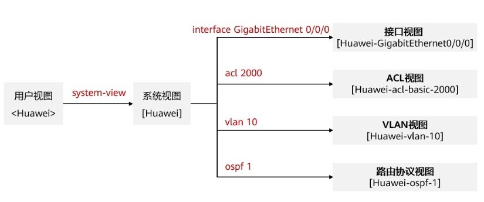
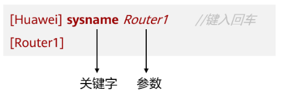

网络设备操作基础
================================================
视图的概念
~~~~~~~~~~~~~~~~~~~~~~~~~~~~~~

华为网络设备提供了丰富的功能，相应地提供了多样的配置和查询命令。为便于用户使用这些命令，华为设备按功能分类将命令分别注册在不同的命令行视图（View）下。配置某一功能时，需首先进入对应的命令行视图，然后执行相应的命令进行配置。视图的定义使得命令行的配置更模块化也更严谨、更层次化。

常用的命令行视图及进入方式
--------------------------

（1）	用户视图

登陆设备后，直接进入用户模式，只能执行少量查看配置的命令；例如查看设备信息：display version，显示当前配置：display current-configuration.

.. code-block:: sh
   :linenos:

   <Huawei>

（2）	视图模式

用户模式下，输入system-view进入视图模式，可执行设备全局配置的命令。

.. code-block:: sh
   :linenos:

   <Huawei>system-view
   Enter system view, return user view with Ctrl+Z.
   [Huawei]

 
（3）	局部配置模式

视图模式下，输入局部配置命令，如interface g0/0/1，进入G0/0/1端口配置模式。

.. code-block:: sh
   :linenos:

   [Huawei]int g0/0/1
   [Huawei-GigabitEthernet0/0/1]
 
此外局部配置模式有很多种，可根据不同需求进入vlan配置模式、端口聚合配置模式等，可输入？，查看当前模式下，能执行哪些命令。

退出当前命令行视图
--------------------------
执行quit命令，即可从当前视图退出至上一层视图。

命令的结构
~~~~~~~~~~~~~~~~~~~~~~~~~~~~~~

在命令行界面中，通过输入特定的命令及参数来完成对设备的调试。例如上面的例子中“sysname Router1”这条命令，“sysname”是关键字，“Router1”是参数，这条命令的意思是将该设备的名称修改为Router1，命令输入后按回车，会发现系统的提示符发生了改变，变成了“[Router1]”。

编辑命令行
~~~~~~~~~~~~~~~~~~~~~~~~~~~~~~

不完整关键字输入
--------------------------
华为设备支持不完整关键字输入。例如display current-configuration命令，可以输入d cu，di cu或dis cu等都可以执行此命令，但不能输入d c或dis c等，因此以d c、dis c开头的命令不唯一。

tab键的使用
--------------------------
输入不完整的关键字后按下Tab键，系统自动补全关键字。

使用命令行的帮助功能
--------------------------
当一条命令中某个关键字只记得开头的几个字母时，可在键入开头字母后紧接着键入“?”，例如，“ip rou?”，系统即会自动弹出提示信息，提示当前“rou”开头的关键字有哪些。

.. code-block:: sh
   :linenos:

   [Huawei]ip rou?
   route             <Group> route command Group
   route-static      IPv4 static routes

在当前关键字后键入空格，然后再输入“?”，系统会自动弹出可选关键字或参数的提示信息。

常用配置命令
--------------------------

.. code-block:: sh
   :linenos:

      <Huawei>system-view  // 由用户视图进入系统系统
      [Huawei]ping  //测试网络连通性
      [Huawei]reboot //重启交换机/路由器

      [Huawei]display interface  //查看路由器的接口状态
      [Huawei]display ip interface  //查看接口与IP相关的信息
      [Huawei]display ip interface brief  //查看接口状态
      [Huawei]display ip routing-table  //查看路由表
      [Huawei]display vlan  //查看vlan信息
      [Huawei]display port vlan  //查看端口vlan信息
      [Huawei]display current-configuration  //查看运行的配置文件
      [Huawei]display interface Gigabitethernet 0/1 //显示以太网端口g0/0/1 的信息

      [Huawei]interface Gigabitethernet 0/0/1 //进入以太网端口g0/0/1视图
      [Huawei-Gigabitethernet0/0/1]shutdown //关闭以太网端口
      [Huawei-Gigabitethernet0/0/1]undo shutdown //打开以太网端口

      [Huawei-Gigabitethernet0/0/1]port link-type access //设置端口为 Access 端口
      [Huawei-Gigabitethernet0/0/1]port link-type hybrid //设置端口为 Hybrid 端口
      [Huawei-Gigabitethernet0/0/1]port link-type trunk //设置端口为 Trunk 端口
      [Huawei-Gigabitethernet0/0/1]undo port link-type //恢复端口的链路类型为缺省的 Access 端口

      [Huawei-Gigabitethernet0/0/1]quit //从端口视图退出到系统视图
      [Huawei]quit //从系统视图退出到用户视图
      <Huawei>

