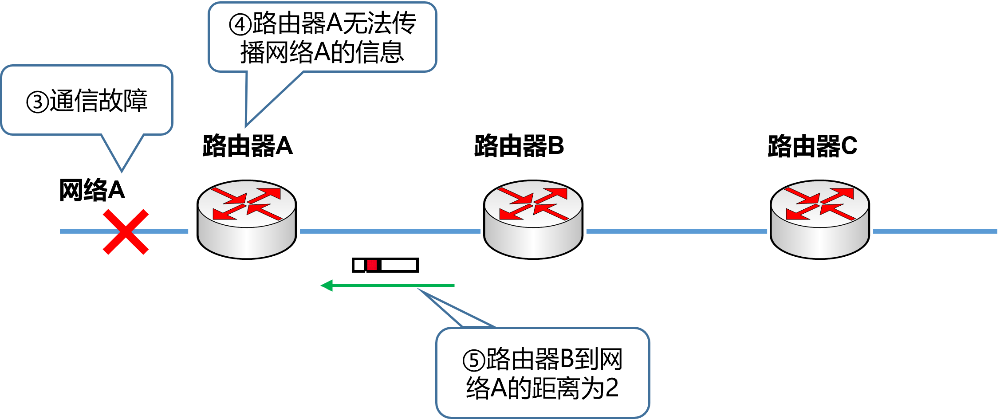
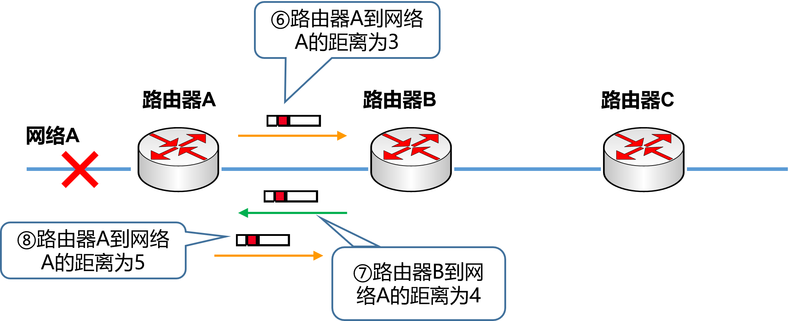
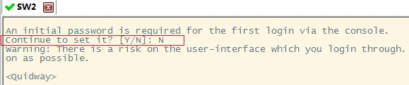
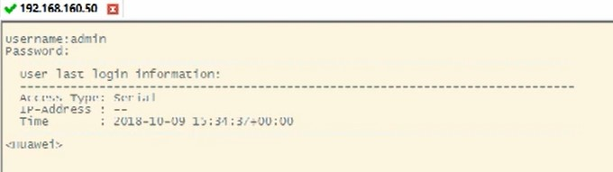
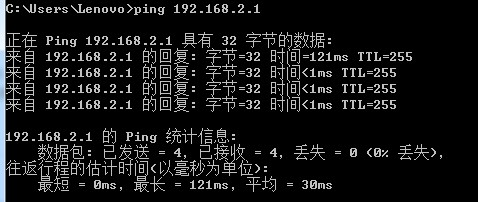
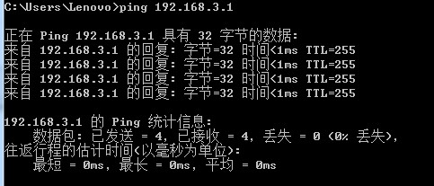

实验目的
=====================

1. 了解动态路由协议的原理与应用。
2. 熟悉RIP协议的特点，理解水平分割、触发更新和毒性逆转的作用。
3. 掌握RIP协议的配置方法。

实验任务
=====================
掌握RIP的配置方法，在计算机上用Wireshark截取RIP报文，理解触发更新和水平分割对RIP收敛速度和避免环路的作用。

实验原理
=====================

RIP概要
~~~~~~~~~~~~~~~~~~~~~~~~~~~~~~

RIP（Routing Information Protocol）是基于距离矢量算法的一种路由协议，它使用“跳数”，即指所经过的路由器的个数来衡量到达目标地址的路由距离，广泛应用于LAN。BSD UNIX系统的routed进程采用了RIP协议，由此RIP得到了迅速的普及。

RIP协议特点
~~~~~~~~~~~~~~~~~~~~~~~~~~~~~~
RIP协议特点可归纳如下：

1. 30秒一次，将自己所知道的路由信息广播出去。如果一个路由在180秒内未被刷，就认为网络被断开。
2. 根据距离向量生成路由控制表。路由控制表针对同一个网络如果有两条路径，那么选择距离较短的一个。如果距离相等，通常是随机选择一个或是轮换使用。

但是，这两个特点使得RIP明显存在一些问题。如下图所示，当网络A存在通信故障时，路由器A虽然认为自己与网络A的连接已经断开了，但是它还会收到路由器B曾经获知的路由消息，这就会让路由器A误认为还可以通过路由器B到达网络A。这样就会导致无限计数（Counting to Infinity），出现路由环路。

.. image:: RIP1.png

为了解决这个问题，RIP采取以下两种方法：

1. 最长跳数不超过16（16被定义成无穷大，即目标网络或主机不可达）。这个信息只保留120秒。一旦超过这个时间，信息将被删除。
2. 采用 **水平分割** （Split Horizon）方法，即路由器不在把所收到的路由信息原路返回给发送端。

然而，在环路有多余的情况下，需要很长时间才能产生正确的路由信息。在有些情况下（比如帧中继Hub-spoke网络结构、X.25等非广播多路访问网络）需要关闭水平分割，否则将无法正常传递路由信息。

为了尽可能解决这个问题，RIP又提供了毒性逆转（Posion Reverse）和触发更新（Triggered Update）机制。

**毒性逆转** 是水平分割的一种变型。当网络发送故障时，它不是不再发送这个消息，而是发送一个距离为16的消息。

**触发更新** 是指当网络发生变化时，路由器就立即发送其新的路由表，而不是等待30秒。

**保持定时器法** 是设置路由信息被抑制的时间，默认为180s。当路由条目不可达的时候，抑制时间内不会接受该路由条目的更新；除非从该路由条目的发送方接受到了更优的路由条目，或者保持计时器到期为止。

.. hint::
  
  通过上述方法，RIP的最大网络范围在16跳以内，而且路由器想要达到一个稳定的状态也需要花一段时间。如果想要明确地掌握网络结构，可以采用路由协议相对复杂的OSPF（Open Short Path First）路由协议，在本实验中不做重点介绍。

RIP报文格式
~~~~~~~~~~~~~~~~~~~~~~~~~~~~~~
RIP协议使用UDP协议的520端口来发送和接收RIP报文。RIP协议有两个版本：RIPv1和RIPv2。RIPv2是RIPv1的加强版，与RIPv1相比，功能上明显增强，也提高了对错误的抵抗能力。RIPv1的response报文是广播报文，目的地址是255.255.255.255。为了减轻那些不接收RIP协议数据包的主机的不必要负载，RIPv2采用组播地址224.0.0.9进行周期性地广播。RIPv2的报文格式如下图所示。

.. image:: RIP格式.png

(1)	 **命令字(Command)** ：1为请求报文，2为应答报文。

(2)	 **版本 (Version)** ：指生成RIP报文时所使用的版本，RIP只有两个版本:版本1和版本2。

(3)	 **路由选择域 (Routing Domain)** ：路由域标号为0的是缺省的路由域。

(4)	 **地址族标识（Address Family Identifier）** ：报文中所携带地址的类型，提供了和以前版本的兼容性。IP协议簇对应的值为2，该字段使RIP可以用于多种不同的协议簇。

(5)	 **路由标记(Route Tag)**  ：用于传递自治系统的标号。

(6)	 **IP地址(IP Address)** ：可以是主机、网格，甚至是一个缺省网关地址。

(7)	 **子网掩码(Subnet Mask)** ：子网掩码信息是RIP协议在多种环境中变得更有用，并且允许在网络中使用变长掩码。

(8)	 **下一跳地址(Next Hop)** ：支持下一跳地址优化了在使用多种路由协议的网络环境中的路由器。

(9)	 **度量值（Metric）** ：这个值经过路由器时被递增。数量标准有效的范围是在1～15之间。

实验环境与分组
=====================

路由器2台、二层交换机2台，三层交换机1台，计算机4台，4人一组。

实验设备和组网要求
=====================

实验机柜设备拓扑详见 :doc:`/lab4/index` 的“实验设备和组网要求”。本次实验需要将实验机柜的网络拓扑改成如下结构：

.. image:: 6-2.jpg

IP地址表：

==============     =========================
设备名称    	        IP地址    
==============     =========================
R1-G0/0/0           192.168.2.1/24  
R2-G0/0/0			      192.168.3.2/24  
R1-G0/0/9	 	 	      192.168.1.1/24  
R2- G0/0/9     	    192.168.1.2/24  
R1-loopback 1		    1.1.1.1/32  
==============     =========================

.. note:: 
  **Loopback说明**

  Loopback是一种纯软件性质的虚拟接口，Loopback接口一旦被创建，将一直保持UP状态，直到被删除。路由器和三层交换机都可以配置Loopback接口。任何送到该接口的网络数据报文都会被认为是送往路由器自身的。

实验步骤
=====================

登陆设备
~~~~~~~~~~~~~~~~~~~~~~~~~~~~~~

Step1：
------------------------------
打开SecureCRT，点击窗口中的“快速连接”图标，如图所示：

.. image:: 1-2.jpg

Step2：
------------------------------
在弹出的窗口中，输入需通过telnet访问的设备IP（见表 :ref:`ATM管理机地址表` ）和端口号，然后点击“连接”即可。

.. image:: 1-3.jpg

.. _ATM管理机地址表:

.. list-table:: ATM管理机地址表
   :widths: 20 30
   :header-rows: 1
   :align: center

   * - 机柜编号
     - ATM管理路由器的IP地址
   * - 1
     - 10.251.130.241
   * - 2
     - 10.251.130.242
   * - 3
     - 10.251.130.243
   * - 4
     - 10.251.130.244
   * - 5
     - 10.251.130.245
   * - 6
     - 10.251.130.246
   * - 7
     - 10.251.130.247
   * - 8
     - 10.251.130.248
   * - 9
     - 10.251.130.249
   * - 10
     - 10.251.130.250

Step3：
------------------------------

.. hint:: 
  
     **交换机不需要输入用户名和密码** 即可进行基本的配置和管理。
    
     **路由器需要输入用户名和密码，R1和R2路由器的用户名：admin，密码：Admin@huawei** 。路由器用户名和密码是用于保护路由器的配置和管理界面，防止未经授权的访问和修改。

交换机登录成功后，即进入用户视图。

路由器输入用户名和密码，登录成功后，进入用户视图。在用户视图下，用户可以完成查看运行状态和统计信息等功能，此时屏幕上显示:

清空配置
~~~~~~~~~~~~~~~~~~~~~~~~~~~~~~
每次做实验前，先清空上一次的配置，本次实验需清空R1、R2、SW1、SW2、SW3的配置。  

Step1：
------------------------------

在用户视图下，使用如下命令进行配置的清空

.. code-block:: c
   :linenos:

   reset saved-configuration //清除配置
   The device configurations will be erased to reconfigure. Are you sure?(y/n):y //输入y继续删除
   display saved-configuration //查看删除后的配置

查看删除后的配置：

.. image:: 2-4.jpg

Step2：
------------------------------
在用户视图下，使用如下命令进行重启。注意不要输错。

.. code-block:: c
   :linenos:

   reboot //重启
   All the configuration will be saved to the next startup configuration. Continue? [y/n]:n //输入n不保存到启动配置
   System will reboot! Continue? [y/n]: //输入y，继续重新启动
   display current-configuration //重启后查看当前配置

.. image:: 2-5.jpg

导入初始配置
~~~~~~~~~~~~~~~~~~~~~~~~~~~~~~

R1导入下列配置

.. code-block:: c
   :linenos:

   system-view 
   sysname R1
   user-interface console 0
   idle-timeout 60
   quit
   int G0/0/9
   undo ip add
   quit
   int G0/0/8
   shutdown
   quit
   quit

上述命令功能为：

1. 进入系统视图 
2. 为路由器配置系统名称
3. 进入console配置模式
4. 设置超时时间为60min，默认为10min
5. 退出console配置模式
6. 进入G0/0/9 端口配置模式
7. 删除G0/0/9 端口的IP地址
8. 退出G0/0/9 端口配置模式
9. 进入G0/0/8 端口配置模式
10. 关闭G0/0/8 端口
11. 退出G0/0/8 端口配置模式
12. 退出系统视图

R2导入下列配置
	
.. code-block:: c
   :linenos:

   system-view 
   sysname R2
   user-interface console 0
   idle-timeout 60
   quit
   int G0/0/9
   undo ip add
   quit
   int G0/0/8
   shutdown
   quit
   quit
	
SW1导入下列配置

.. code-block:: c
   :linenos:

   system-view 
   sysname SW1
   user-interface console 0
   idle-timeout 60
   quit
   int range G0/0/1 to G0/0/4
   shutdown
   quit
   quit

SW2导入下列配置
	
.. code-block:: c
   :linenos:

   system-view 
   sysname SW2
   user-interface console 0
   idle-timeout 60
   quit
   int range G0/0/1 to G0/0/4
   shutdown
   quit
   quit

SW3导入下列配置

.. code-block:: c
   :linenos:

   system-view 
   sysname SW3
   user-interface console 0
   idle-timeout 60
   quit
   int range G0/0/1 to G0/0/4
   shutdown
   quit
   quit

导入信息步骤如下图所示：
复制以上的代码并分别粘贴入SW2、SW3。

.. image:: 2-6.jpg

.. image:: 2-7.jpg

配置三台PC的IP地址
~~~~~~~~~~~~~~~~~~~~~~~~~~~~~~

按照下表设置PCA、PCC和PCD这三台电脑的IP地址。

注意，实验室电脑上有两个有线网卡，我们需要配置的是第二块网卡，即“以太网2”。

========    =====================
计算机       IP地址  
========    =====================
PCA     	  192.168.2.11/24	
PCC		      192.168.3.13/24	  
PCD		      192.168.3.14/24
========    =====================

配置路由器、交换机基本信息和计算机的网关
~~~~~~~~~~~~~~~~~~~~~~~~~~~~~~~~~~~~~~~~~~~~~~~~~~~~~~~~~~~~

插拔网线
------------------------------
按照组网图正确组网，打开机柜，把 PCB 的网线接口接到 SW1 的 G0/0/12 上。

.. note:: 
  **插拔网线的正确方法**

   **拔出网线** ：  
     1. 轻轻按压。按住水晶头的突出部分，然后缓慢而平稳地将网线从接口中拔出。 **切勿直接硬拔网线，以免损坏设备接口或插头** 。  
     2. 检查连接：确保在拔出网线后，设备没有受到任何损坏，并检查网线的水晶头是否完好无损。

   **插入网线** ：  
     1. 检查网线。首先，确保网线没有损坏，且所有线芯都完好无损。  
     2. 识别接口。找到设备上的网络接口。  
     3. 轻轻插入：用适当的力量将网线的水晶头插入接口。当感觉到轻微的阻力或者有“咔”的声音时，说明网络已经接触到接口底部。  
     4. 检查连接：一旦网线插入，检查设备是否识别到网络连接。通常，设备上会有一个指示灯亮起，表示连接已建立。
 

配置R1的基本信息
------------------------------

.. code-block:: c
   :linenos:
   
   system-view //进入系统视图
   interface G0/0/9 //进入G0/0/9接口模式
   ip address 192.168.1.1 255.255.255.0 //配置G0/0/0接口ip地址
   quit //退出接口视图
   interface G0/0/0 //进入G0/0/0接口模式
   undo portswitch //把G0/0/0默认的二层接口转为三层接口
   ip address 192.168.2.1 255.255.255.0 //配置G0/0/0接口ip地址
   quit //退出接口视图
   interface loopback 1 //配置Loopback回环接口。Loopback是一种纯软件性质的虚拟接口，该接口一旦被创建，将一保持Up状态，直到被删除
   ip address 1.1.1.1 255.255.255.255 //配置回环地址
   quit //退出接口视图

配置R2的基本信息
------------------------------

.. code-block:: c
   :linenos:

   system-view //进入系统视图
   interface G0/0/9 //进入G0/0/9接口模式
   ip address 192.168.1.2 255.255.255.0 //配置G0/0/0接口ip地址
   quit //退出接口视图
   interface G0/0/0 //进入G0/0/0接口模式
   undo  portswitch //把G0/0/0默认的二层接口转为三层接口
   ip address 192.168.3.1 255.255.255.0 //配置G0/0/0接口ip地址
   quit //退出接口视图

配置三台计算机的网关
------------------------------

注意，一台电脑只能有一个默认网关，需要把“以太网”的默认网关删掉，才能配置“以太网2”的默认网关。

PCA网关为192.168.2.1，PCC和PCD网关为192.168.3.1

PCA通过默认网关将发往未知网络的数据交由R1处理。同理PCC和PCD通过默认网关将数据交给R2。

在R1上ping R2验证连通性
------------------------------

在PCA上ping R1验证连通性
------------------------------

在PCC上ping R2验证连通性
------------------------------

在PCA上ping PCC验证连通性
------------------------------

.. image:: 6-6.jpg

此时，还没有设置RIP路由协议，PCA和PCC还不能相互连通。

.. attention:: 在启动RIP协议前，在R1上ping各台计算机，看是否能够ping通？通过在R1上查看路由表，分析其原因？
   
   *（请把答案写到实验报告中）* 

配置RIP协议及查看路由表，并测试连通性
~~~~~~~~~~~~~~~~~~~~~~~~~~~~~~~~~~~~~~~~~~~~~~~~~~~~~~~~~~~~

为两台路由器和三层交换配置RIP协议，并通告其网络。具体命令如下：

在路由器R1上启用RIP协议
------------------------------
在R1的系统视图下：

.. code-block:: c
   :linenos:

    system-view //进入系统视图
    rip  //启用RIP协议
    undo summary //关闭自动汇总功能
    version 2 //配置RIP路由协议版本v2
    network 192.168.1.0 //通告直连网段，在网段192.168.1.0上启动RIP
    network 192.168.2.0 //通告直连网段，在网段192.168.2.0上启动RIP
    network 1.0.0.0 //通告直连网段，在网段1.0.0.0上启动RIP
    quit //退出路由配置模式

在路由器R2上启用RIP协议
------------------------------

R2-系统视图：

.. code-block:: c
   :linenos:

    system-view //进入系统视图
    rip  //启用RIP协议
    undo summary //关闭自动汇总功能
    version 2 //配置RIP路由协议版本v2
    network 192.168.1.0 //通告直连网段，在网段192.168.1.0上启动RIP
    network 192.168.3.0 //通告直连网段，在网段192.168.2.0上启动RIP
    quit //退出路由配置模式

查看R1和R2的路由表
------------------------------
使用display ip routing-table命令在R1和R2上查看路由表信息

R1路由表:

.. image:: 6-7.jpg

R2路由表:

.. image:: 6-8.jpg

使用ping命令测试PCA到PCC之间的连通性
------------------------------

.. image:: 6-9.jpg

配置RIP路由协议后，PCA能访问到PCC了。

.. attention:: 在配置RIP协议后，比较和配置RIP协议前中R1路由表的差异；测试R1和各台计算机是否能够通信，并说明原因。
   
   *（请把答案写到实验报告中）*
触发更新和水平分割
~~~~~~~~~~~~~~~~~~~~~~~~~~~~~~~~~~~~~~~~~~~~~~~~~~~~~~~~~~~~

.. _PCB的RIP报文:

观察RIP报文
------------------------------
分别打开PCA 、PCB、PCC三台计算机的Wireshark抓取rip协议包，具体操作见三层交换中arp抓包实验。

此时查看PCA上截获 R1 g0/0/0 发出的报文，有4条路由信息。其中，到192.168.3.0路由需要2跳。从下图可知，每两条RIP报文相差间隔差不多是30s，这也验证了RIP是每30s将自己所知道的路由信息广播出去。

PCB上截获 R1 g0/0/9 发出的报文，有2条路由信息。

.. image:: 671PCB.PNG

PCC上截获 R2 g0/0/0 发出的报文，有4条路由信息。

观察触发更新报文
------------------------------
然后在R1上使用命令 undo interface loopback1断开回环地址loopback1，四台PC都连接不到loopback1，PCA、PCB和PCC结果如下图所示。

PCA截获到1.1.1.1网段不可达。

.. attention:: 请找到触发更新报文，该报文与上一条RIP报文相隔时间是否为30s？

.. image:: 672PCA.PNG

PCB截获到1.1.1.1网段不可达。

PCC截获到1.1.1.1网段不可达。

由上图可知，到达1.1.1.1的跳数为16，因为rip协议的最大跳数为15，所以这条IP不可达。一条路有切断，全网通告。

.. attention:: 观察你所截获的RIP响应报文（任选一条响应报文），并填写实验报告。
   
   *（请把答案写到实验报告中）*

观察取消水平分割前后报文差异
------------------------------
RIP配置后，默认启动水平分割。水平分割就是此接口接收到的信息不从这个接口发回去。从上面    :ref:`PCB的RIP报文` 的PCB报文图中可以看出，从R1 g0/0/9 接收到的192.168.1.0 和 192.168.3.0 路由信息，将不再从R1 g0/0/9 发出这两条信息。

接下来，你需要 **重新配置loopback1** （配置方法参考上述给出的配置命令），使个路由器运行RIP，正常工作。然后， **取消路由器R1和R2的水平分割功能** ，以R1的g0/0/9接口为例命令如下，观察取消水平分割后的RIP报文。

R1基本配置

.. code-block:: c
   :linenos:
   
   interface g0/0/9
   undo rip split-horizon

此时查看 PCB 上截获 R1 g0/0/9 发出的报文，可以看到多了两条来自 192.168.1.0 和 192.168.3.0 的报文。

.. attention:: 比较水平分割前后R1发给R2的RIP报文路由信息的不同，并填写实验报告。
   
   *（请把答案写到实验报告中）*
